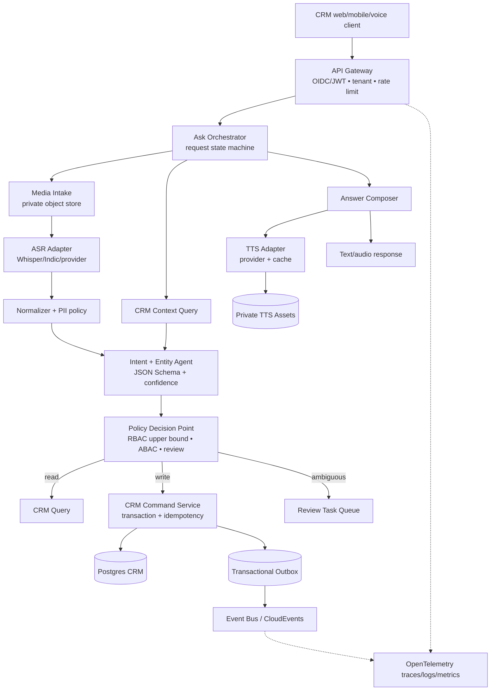

## System map

## Bounded contexts

| Context           | Owner           | Source of truth               | Input                    | Output                                                      |
| ----------------- | --------------- | ----------------------------- | ------------------------ | ----------------------------------------------------------- |
| Identity & Tenant | Platform        | IdP/tenant DB                 | JWT/request              | active principal, roles, actor/token scopes, policy version |
| Voice Media       | Media Platform  | object store + media metadata | bytes/MIME               | asset, checksum, duration                                   |
| Understanding     | Agent Platform  | versioned inference record    | transcript + CRM context | intent/entity proposal                                      |
| CRM Domain        | CRM Team        | Postgres aggregates           | validated commands       | committed aggregate/version                                 |
| Review            | CRM Operations  | review task store             | ambiguous proposals      | approve/reject/corrections                                  |
| Interaction       | Experience Team | request/event projections     | all prior results        | answer, audio URL, UI events                                |

## Design patterns

- Composition root and explicit scopes: `src/composition-root.mjs` wires process
  singletons and exposes a small ports object. Request context is immutable and
  operation/transaction lifetimes remain explicit; no heavy DI container or
  ambient tenant state is used.
- Governed inversion of control: `src/extensions/` validates closed manifests,
  grants only deployment-approved permission ports, and serializes dependency
  startup/rollback/shutdown. Built-ins may run in process only by trusted ID;
  external code requires a trusted process supervisor rather than dynamic import.
  The Linux Rust supervisor owns the child process group, readiness handshake,
  cooperative stop and bounded hard termination; Node retains orchestration and
  application policy.
- Control Engine: `src/control/` owns extension lifecycle and keyed epoch-aware
  compare-and-swap circuit breakers so stale completions cannot corrupt a newer
  half-open/recovered cycle.
- Managed lifecycle: `src/lifecycle/managed-task-registry.ts` owns background
  tasks, cooperative cancellation, bounded teardown and supervised termination.
  The outbox poller is registered work rather than an unowned module loop.
- Semantic Guardian governor: turn-level denial windows interrupt repeated
  unsafe review cycles independently of provider availability circuits. The
  permission-review adapter itself remains a future, fail-closed integration.
- Conversation state: the application service is the only adapter-facing port;
  PostgreSQL replaces encrypted state with an expected-revision CAS so stale
  web, SSE, MCP, desktop or TUI writers cannot overwrite a newer turn.
- Hexagonal architecture: the provider facade owns selection, deadlines, circuit isolation and error mapping; mock, OpenAI-compatible and DashScope adapters implement `transcribe`, `understand`, `synthesize`. The domain never imports provider SDKs or vendor protocols.
- CQRS-lite: query context is separate from command path; commands return aggregate version.
- Transactional outbox: domain mutation and event record commit atomically; relay is retryable.
- Saga/compensation: external notification or TTS failure never silently rolls back a committed CRM transaction; status/event records describe compensation.
- State machine: explicit request/job states; invalid transitions fail closed.
- Authorization-as-code: `contracts/authorization-policy.json` defines a
  closed RBAC ceiling and named ABAC conditions. Actor and token scopes can
  only reduce that ceiling. Application services are the authoritative PEP;
  PostgreSQL reloads active actor facts and rechecks mutations in the same
  transaction as business state, audit and outbox writes.
- Idempotent command: `(tenant_id, idempotency_key)` unique; repeated requests replay the original result.
- Anti-corruption layer: adapters translate external provider and import schemas
  into owned domain contracts without importing external source models.

## Ownership rules

1. Agent owns proposal and explanation, never authoritative CRM data.
2. CRM owns IDs, invariants, transaction, version and audit event.
3. Gateway owns authentication and request correlation, not model policy.
4. Media owns bytes, checksum and retention; product tables store references only.
5. Event consumers are at-least-once and must be idempotent; no consumer edits event history.

## Agent runtime contract

An agent run has `run_id`, `conversation_id`, `request_id`, `tenant_id`, `actor_id`, `model_id`, `model_version`,
`tool_policy_version`, `input_hash`, `deadline_at`, `budget`, `attempt`, `parent_run_id`. Context is selected through
authorized CRM query tools; prompt and tool definitions are versioned artifacts. Tool results are untrusted until schema/policy validation.

## Failure isolation

Each provider call has a cooperative 10-second soft deadline followed by a
2-second hard-stop grace, adapter-and-capability CAS circuit state, and redacted
error mapping. Caller cancellation and input/configuration rejection do not open
a provider circuit. The orchestrator persists encrypted interaction checkpoints
plus an append-only transition journal, reclaims only expired leases through a
database CAS, never retries a non-idempotent CRM command without its idempotency
key, stores audio in private object storage, and relays transactional outbox rows
independently. PostgreSQL, OIDC/JWKS, S3-compatible objects, OpenAI-compatible
providers and DashScope are implemented adapters; successful staging connectivity,
quality, security review and release approval remain promotion evidence rather
than source-code claims.
