## Pipeline

```mermaid
flowchart LR
  commit[Commit/PR] --> lint[format + syntax + secret scan]
  lint --> contract[OpenAPI/event/schema checks]
  contract --> unit[unit + property tests]
  unit --> integration[integration DB/object-store/provider mocks]
  integration --> security[SAST/SCA/SBOM/IaC scan]
  security --> image[reproducible OCI image]
  image --> provenance[attestation + signature]
  provenance --> staging[staging smoke/chaos/rollback]
  staging --> approval[release checklist approval]
  approval --> prod[progressive production deploy]
  prod --> observe[SLO/trace/error budget]
```



## Local gates

```powershell
npm ci
npm run verify
npm run verify:mcp
npm run audit:deps
npm pack --dry-run
```

`build` produces a dependency-free runtime candidate and `dist/BUILD-MANIFEST.json` with artifact version, sorted file list and digest. `smoke:dist` starts that generated candidate, probes readiness, and stops it. `docs:build` produces the human site and MCP projection under `artifacts/docs-site/`. `verify:mcp` is a cross-repository gate and requires a built Sumi-Docs-MCP entry. `audit:deps` names the official npm registry because some package mirrors do not implement the audit API. Production CI must additionally run a secret scan, SBOM, container scan, image provenance, and signature tooling.

The Dockerfile is a multi-stage build. Its runtime stage contains only the generated `dist/` candidate and runs as the unprivileged `node` user. A Docker build remains an explicit failed or not-run gate when the validation host has no Docker CLI or daemon.

## Branch and change policy

- Target policy: protected `main`, required PRs, and CODEOWNERS review for contracts, security, database, and release files. Current enforcement status is recorded in [Development and release readiness](RELEASE-READINESS.md).
- Conventional commits; one bounded change per PR; ADR required for boundary/schema/lifecycle changes.
- Contract changes are additive by default; breaking changes require major API/event version and migration plan.
- No generated artifact or secret committed; no direct production mutation from a development shell.

## CI operations agent

`.github/workflows/operations-agent.yml` observes completed `ci` runs on `main`, performs a weekly drift check, and supports manual inspection. The observation job has read-only repository permission and produces a 30-day JSON snapshot. Issue reconciliation is a separate job with only `issues: write`; it does not check out or execute repository code.

The agent may open, update, or close the deterministic `[CI Operations] main requires attention` Issue. It may not modify source, change a checkpoint to complete, approve a release, create a tag, publish, or deploy. Its snapshot and Issue are operational signals, not release authorization.

## Release artifact

Release contains OCI image digest, source commit, dependency lock hash, OpenAPI/event schema version, DB migration range,
SBOM, provenance/signature, test report, security report, SLO dashboard link, rollback digest and operator approval.

## Progressive delivery

1. Deploy migrations expand-only.
2. Deploy canary (≤5% tenant traffic) with provider capability checks.
3. Compare error budget, latency, duplicate commands, review rate, ASR/TTS quality and event lag.
4. Promote gradually; keep previous image and feature flags available.
5. Roll back app first on regression; never destructive DB rollback. Complete contract compatibility before cleanup migration.

## Supply-chain target

Use pinned base image, lockfile, SBOM (CycloneDX/SPDX), signed image and provenance attestation. The repository does not pretend to generate these with unavailable local tools; CI ownership and evidence are explicit release gates.
