## Pipeline

```mermaid
flowchart LR
  commit[Commit/PR] --> lint[format + syntax + secret scan]
  lint --> contract[OpenAPI/event/schema checks]
  contract --> unit[unit + property tests]
  unit --> integration[integration DB/object-store/provider mocks]
  integration --> security[SAST/SCA/SBOM/IaC scan]
  security --> image[reproducible OCI image]
  image --> provenance[attestation + signature]
  provenance --> staging[staging smoke/chaos/rollback]
  staging --> approval[release checklist approval]
  approval --> prod[progressive production deploy]
  prod --> observe[SLO/trace/error budget]
```



## Local gates

```powershell
pnpm install --frozen-lockfile --ignore-scripts
pnpm run protocol:generate
pnpm run verify:release
pnpm run smoke:docker
pnpm run verify:mcp
pnpm run sbom
pnpm pack --dry-run
```

The repository pins Node `24.18.0` through Volta, pnpm `10.33.4` through the `packageManager` contract, and Rust through `rust-toolchain.toml`. `build` first performs the clean temporary protocol drift check, builds the locked Rust supervisor, then assembles a staging directory and atomically promotes it to `dist/` only after writing and re-reading `dist/BUILD-MANIFEST.json`. The manifest binds each artifact-relative POSIX path, byte count, executable bit and SHA-256 digest to a sorted content-set digest; timestamps and host paths are excluded. A failed staging build leaves the previous `dist/` candidate intact. The candidate carries only the runtime source, Rust supervisor, ordered database migrations and declared dependencies, not the development toolchain. `test:postgres` starts a disposable local PostgreSQL cluster and verifies repeatable migration, two-tenant RLS, encrypted interaction replay and conversation state, durable CRM/media/review data, and outbox lease/retry/dead-letter behavior. `smoke:dist` starts the generated candidate, probes readiness, and stops it. `drill:load` records a bounded concurrent latency/error report; `drill:fault` records provider timeout/circuit/readiness and relay dead-letter behavior. Both JSON reports are written under ignored `artifacts/release/`. `smoke:docker` builds the OCI image, proves the declared production modules and executable supervisor can be loaded, starts the image's normal `dist/src/server.mjs` command as its unprivileged user, probes readiness, and removes its ephemeral image/container. `docs:build` produces the human site and MCP projection under `artifacts/docs-site/`. `verify:mcp` is a cross-repository gate and requires a built Sumi-Docs-MCP entry. `audit:deps` names the official npm registry because some package mirrors do not implement the audit API. `pnpm run sbom` writes an SPDX document covering the production pnpm closure and locked Cargo workspace under `artifacts/release/`. Production CI and release-candidate acceptance require the drills, Docker smoke, Rust dependency audit and repository secret-pattern checks, then upload the manifest, drill reports and SBOM as reviewed evidence; container scan, image provenance and signature tooling remain release gates.

The Dockerfile is a multi-stage build. Its Rust stage builds the locked supervisor
with the exact release toolchain. The Node build stage activates pinned pnpm and
runs `pnpm install --prod --frozen-lockfile --ignore-scripts`, so the copied
dependency closure excludes `devDependencies`; it then produces `dist/`. The
runtime stage contains `/app/dist`, `/app/node_modules`, and runs
`node dist/src/server.mjs` as the unprivileged `node` user. `smoke:docker` is
mandatory in CI and release-candidate acceptance. On a local host without a
usable Docker CLI/daemon it reports an explicit not-run/failure condition rather
than treating the dist-only smoke as container evidence.

## Release-candidate workflow

`.github/workflows/release-candidate.yml` is manually dispatched with an exact
reviewed `main` commit and package version. It refuses to package a stale branch,
an uncompleted C6, or a mismatched version. The acceptance job runs the full
verification, audit, SBOM and deterministic tarball checksum steps, then uploads
an unprivileged candidate. A separate `production-release` environment gate
attests the tarball and SBOM with pinned `actions/attest@v4`; it requires OIDC,
attestation and artifact-metadata permissions. Private-repository attestation
availability is plan-dependent, so an unavailable capability is a recorded
release hold rather than a substituted unsigned artifact.

## Branch and change policy

- Target policy: protected `main`, required PRs, and CODEOWNERS review for contracts, security, database, and release files. Current enforcement status is recorded in [Development and release readiness](RELEASE-READINESS.md).
- Conventional commits; one bounded change per PR; ADR required for boundary/schema/lifecycle changes.
- Contract changes are additive by default; breaking changes require major API/event version and migration plan.
- No generated artifact or secret committed; no direct production mutation from a development shell.

## CI operations agent

`.github/workflows/operations-agent.yml` observes completed `ci` runs on `main`, performs a weekly drift check, and supports manual inspection. The observation job has read-only repository permission and produces a 30-day JSON snapshot. Issue reconciliation is a separate job with only `issues: write`; it does not check out or execute repository code.

The agent may open, update, or close the deterministic `[CI Operations] main requires attention` Issue. It may not modify source, change a checkpoint to complete, approve a release, create a tag, publish, or deploy. Its snapshot and Issue are operational signals, not release authorization.

## Release artifact

Release contains OCI image digest, source commit, dependency lock hash, OpenAPI/event schema version, DB migration range,
SBOM, provenance/signature, test report, security report, SLO dashboard link, rollback digest and operator approval.

## Progressive delivery

1. Deploy migrations expand-only.
2. Deploy canary (≤5% tenant traffic) with provider capability checks.
3. Compare error budget, latency, duplicate commands, review rate, ASR/TTS quality and event lag.
4. Promote gradually; keep previous image and feature flags available.
5. Roll back app first on regression; never destructive DB rollback. Complete contract compatibility before cleanup migration.

## Supply-chain target

Use pinned base image, lockfile, SBOM (CycloneDX/SPDX), signed image and
provenance attestation. Build and release Actions are pinned to full commit
SHAs. The repository does not pretend to generate private-repository attestations
when the GitHub plan cannot support them; the candidate remains held until the
platform owner supplies that capability or records a time-bound waiver with a
compensating control.
