# Build chain, CI/CD and release governance

## Pipeline

```mermaid
flowchart LR
  commit[Commit/PR] --> lint[format + syntax + secret scan]
  lint --> contract[OpenAPI/event/schema checks]
  contract --> unit[unit + property tests]
  unit --> integration[integration DB/object-store/provider mocks]
  integration --> security[SAST/SCA/SBOM/IaC scan]
  security --> image[reproducible OCI image]
  image --> provenance[attestation + signature]
  provenance --> staging[staging smoke/chaos/rollback]
  staging --> approval[release checklist approval]
  approval --> prod[progressive production deploy]
  prod --> observe[SLO/trace/error budget]
```



## Local gates

```powershell
npm test
npm run check
npm run build
```

`build` produces `dist/BUILD-MANIFEST.json` with artifact version, sorted file list and digest. Production CI must additionally run a lockfile install, Node version pin, dependency audit, secret scan, SBOM and image/provenance tooling.

## Branch and change policy

- Protected `main`; PR required, CODEOWNERS review for contracts, security, database and release files.
- Conventional commits; one bounded change per PR; ADR required for boundary/schema/lifecycle changes.
- Contract changes are additive by default; breaking changes require major API/event version and migration plan.
- No generated artifact or secret committed; no direct production mutation from a development shell.

## Release artifact

Release contains OCI image digest, source commit, dependency lock hash, OpenAPI/event schema version, DB migration range,
SBOM, provenance/signature, test report, security report, SLO dashboard link, rollback digest and operator approval.

## Progressive delivery

1. Deploy migrations expand-only.
2. Deploy canary (≤5% tenant traffic) with provider capability checks.
3. Compare error budget, latency, duplicate commands, review rate, ASR/TTS quality and event lag.
4. Promote gradually; keep previous image and feature flags available.
5. Roll back app first on regression; never destructive DB rollback. Complete contract compatibility before cleanup migration.

## Supply-chain target

Use pinned base image, lockfile, SBOM (CycloneDX/SPDX), signed image and provenance attestation. The repository does not pretend to generate these with unavailable local tools; CI ownership and evidence are explicit release gates.
